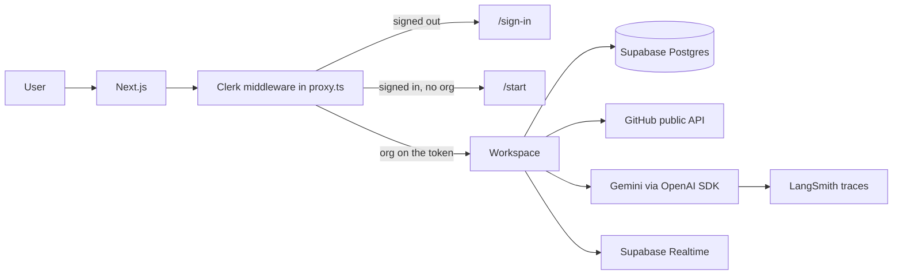
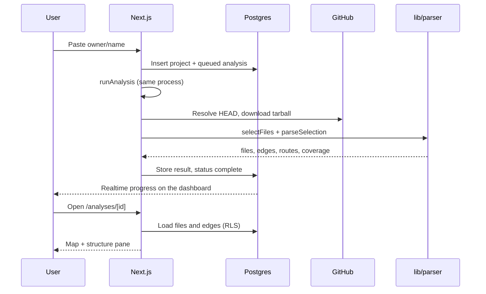
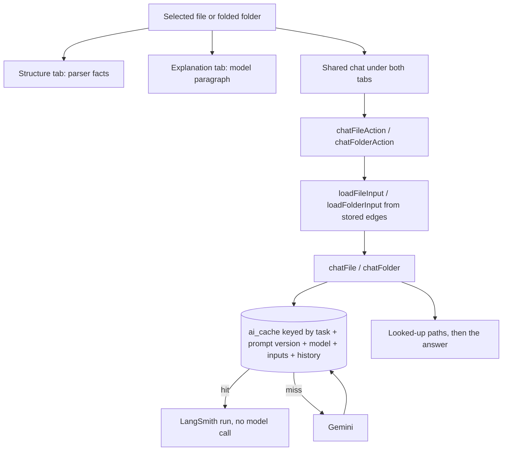

# Cartograph

A local app that reads a public GitHub repository and draws it as a dependency map. Everything on screen comes from really parsing the code. The AI explains what the parser found; it never decides what is there.

```
Sign in → paste a public TS/JS repo URL → parse imports into a graph → map, structure, explanation, and a chat pinned to the selection
```

## Table of contents

1. [Overview](#overview)
2. [Why this platform](#why-this-platform)
3. [What it is (and is not)](#what-it-is-and-is-not)
4. [Tech stack](#tech-stack)
5. [System structure](#system-structure)
6. [System architecture](#system-architecture)
7. [Project structure](#project-structure)
8. [Overall setup](#overall-setup)
9. [Getting started](#getting-started)
10. [Local execution](#local-execution)
11. [How an analysis runs](#how-an-analysis-runs)
12. [Rules that must stay true](#rules-that-must-stay-true)

---

## Overview

Cartograph is for a developer opening a TypeScript or JavaScript codebase they did not fully read — often one they built themselves with an agent, across many sessions, and can no longer hold in their head. They can read code. What they cannot see is its shape.

You sign in, belong to an organization, paste a **public** GitHub URL, and get:

- Folders as boxes and imports as lines
- A file’s real imports and importers
- Blast radius and dependency chain as arithmetic over those edges
- An explanation written from that file (or folder) and its parsed neighbours
- A chat on the same selection, with a lookup list before every answer

An analysis belongs to the organization, not to whoever happened to click submit. The repository is mapped once; everyone in that org starts from the map.

The full product reasoning lives in [`docs/project-doc.md`](docs/project-doc.md). Behaviour for each slice of work lives in [`docs/specs/`](docs/specs/). This README is how the running system is put together.

---

## Why this platform

Codebases now routinely contain code nobody on the team has read. An agent wrote it, someone confirmed it worked, it shipped. That accumulates structure nobody chose: re-export chains, a utility forty files depend on, a module nothing has referenced in months.

The questions that follow are structural. What is this file? What depends on it? What breaks if it changes? Answering them by reading imports one file at a time stops working around thirty files and stops being attempted past a hundred.

Codebase visualisation has failed before (CodeSee, Sourcetrail) because it sold a map of a codebase the user had already read. A map you could have drawn yourself is a nice-to-have. What changed is that people now ship code they have never read, which turns the same artifact into something needed on a specific afternoon.

Most AI “codebase understanding” tools do the opposite of this product: hand the repository to a model and let it describe the structure. That is faster to build. It is also how invented edges get into the picture. Cartograph exists so the graph is a parse, and the model is a narrator of that parse.

The rule everything rests on:

**Every box and every line comes from really parsing the code.** The AI may explain and label. It may never decide that two files are connected, and it may never walk the graph when arithmetic can do it instead.

A graph that is ninety percent right is worse than no graph, because there is no way to tell which ten percent is wrong.

---

## What it is (and is not)

**In scope**

- Sign-in (GitHub, Google, or email) for identity only. No GitHub repo scope, no token storage, public repositories only
- Organizations: every analysis belongs to one; what you can see follows from which org you are in
- Parsing TypeScript and JavaScript: imports, re-exports, dynamic imports, and `require()`
- Framework knowledge as adapters (Next.js, NestJS, Express, Docusaurus, React, then a fallback) — never as `if (framework === …)` inside the parser
- The map, detail pane (Structure + Explanation), blast radius, dependency chain, insights, route table
- File and folder explanation, model labelling when convention cannot identify a file
- Selection-scoped chat, with lookups listed before the answer
- Coverage: what was parsed, what was skipped, and why
- Live progress while a repository is fetched and parsed
- Cached, traced AI calls

**Out of scope (on purpose)**

- Scores, grades, severity, “issues found” — this explains a codebase, it does not review one
- Letting the model pick a starting point and walk the graph
- Private repositories (would require storing a token)
- Approximate routes: if method and full path cannot both be recovered from syntax, show none
- Languages other than TypeScript and JavaScript
- A separate queue, worker, or container fleet — one Next.js app

The chat on a file or folder is **not** a repo-wide agent. It is handed the selected path, its source (for a file), and the neighbours the parser already stored. An answer with nothing listed as looked up is the failure this product exists to prevent.

---

## Tech stack

| Layer           | Choice                                               | Why it is here                                                                                                |
| --------------- | ---------------------------------------------------- | ------------------------------------------------------------------------------------------------------------- |
| App             | Next.js 16 App Router, React 19                      | One deployable. Pages, Server Actions, and the pipeline live in the same process.                             |
| Language        | TypeScript, strict                                   | The parser and the UI share types; `any` is refused.                                                          |
| Parse           | ts-morph (TypeScript compiler API)                   | Imports become edges from syntax, not from a model.                                                           |
| Map             | React Flow (`@xyflow/react`) + dagre                 | Layout is a calculation over files and edges.                                                                 |
| Identity        | Clerk (organizations)                                | The session token carries the org. Application code does not ask Clerk who may see a row.                     |
| Data            | Supabase Postgres + RLS + Realtime                   | Rows belong to an organization. Policies decide who may read them. Progress is a subscription, not a poll.    |
| AI              | OpenAI SDK pointed at Gemini’s OpenAI-compatible API | One wrapped client in `lib/ai/client.ts`. Nothing else constructs an SDK client.                              |
| Observability   | LangSmith                                            | Every AI task is traced. The cache read sits inside the trace, so a hit is a recorded run with no model call. |
| UI              | Tailwind CSS v4                                      | Dense developer tool: small type, tight spacing, monospace paths.                                             |
| Package manager | pnpm (`packageManager` in `package.json`)            | Workspace scripts and installs.                                                                               |

Gemini is reached with `GEMINI_API_KEY` (or `OPENAI_API_KEY` as a fallback name) against `https://generativelanguage.googleapis.com/v1beta/openai/`. Models are pinned in `lib/ai/client.ts` (`gemini-flash-lite-latest` for explain, classify, and chat). Do not install a second AI SDK.

---

## System structure

Four layers, with a hard wall between them.

### 1. Parser (`lib/parser`)

Path in, data out. Walks the tree, extracts imports and exports, resolves specifiers to real files, runs framework adapters, reports coverage.

It must not import Next, React, or the database client. It must run from `node scripts/parse.ts` with nothing else up. Framework knowledge lives in adapters, not in the walker.

### 2. Pipeline (`lib/pipeline`)

Owns the analysis job: claim a queued row, resolve the GitHub HEAD commit, download the tarball, select files, parse, store files / edges / routes / roles, mark complete or failed. Stages are written onto the analysis row so the dashboard can subscribe to progress.

### 3. Graph (`lib/graph`)

Pure functions over a file list and an edge list already in the browser: folding folders, highlighting, blast radius, insights, neighbour lists. No fetching inside these functions. If an answer is arithmetic, it is instant — no spinner.

### 4. Workspace UI + server actions

The signed-in app: dashboard, map, detail pane, explanation, chat. Database access happens in server code (`app/…/actions.ts`, `lib/analysis`, `lib/pipeline/store.ts`), never inside components. Who may read a row is a Postgres policy, not a `where organization_id =` the app remembered to add.

AI tasks (`lib/ai/tasks.ts`) always: trace → cache read → on miss, fetch source if needed → model → cache write.

```
Browser (map, pane, chat)
        │  Server Actions
        ▼
Workspace server (Clerk token → Supabase as the member)
        │
        ├── Parser / pipeline (files, edges, coverage)
        ├── Graph math (already in the client after load)
        └── AI client (Gemini, traced, cached)
                │
                ▼
        Postgres (RLS) + GitHub public API + LangSmith
```

---

## System architecture

### Request and identity



Clerk issues the session. Supabase never owns a login here: the server client passes the Clerk JWT as `accessToken`. RLS policies read the organization id from that JWT (`o.id` or `org_id`). Signing in under another org does not hide rows in the UI — those rows are absent from the query.

### Analysis pipeline



Stages written on the row: `fetch` → `select` → `parse` → `store`, then `complete` or `failed` with the error in the stage where it stopped.

### Explain and chat (selection-scoped)



The model is never given a walk it chose. Neighbours are read from stored edges. Chat threads live in React state for the page session; they are not stored as chat rows. Identical question + file/folder + prior turns hits the cache.

---

## Project structure

```
cartograph-main/
├── app/                          # Next.js App Router
│   ├── layout.tsx                # Root shell, Clerk
│   ├── sign-in/ · sign-up/       # Clerk hosted pages
│   ├── start/                    # Create or join an organization
│   └── (workspace)/              # Requires an active org
│       ├── page.tsx              # Dashboard: analyses + submit URL
│       └── analyses/[id]/        # Map page + server actions
├── components/                   # UI only; no database clients
│   ├── analysis-view.tsx         # Shared map / pane / chat state
│   ├── detail-pane.tsx           # Structure + Explanation + shared chat
│   ├── explanation-panel.tsx
│   ├── file-chat.tsx
│   ├── map/                      # React Flow nodes, layout, swatches
│   └── progress/                 # Realtime analysis rows
├── lib/
│   ├── parser/                   # Standalone: walk, extract, resolve, adapters
│   ├── pipeline/                 # GitHub fetch, stages, store
│   ├── graph/                    # Pure map math
│   ├── analysis/                 # Load stored graph for explain/chat
│   ├── ai/                       # Single client, prompts, traced tasks
│   ├── supabase/                 # Browser, member server, admin writer
│   └── env.ts                    # Required keys checked at boot
├── scripts/                      # parse / analyze / map-counts / insights
├── supabase/
│   ├── migrations/               # Source of truth for schema
│   └── full_schema.sql           # Concatenated picture of the schema
├── docs/
│   ├── project-doc.md            # Product decisions
│   └── specs/phase-NN.md         # One spec per phase, written before building
├── proxy.ts                      # Clerk middleware (Next 16)
├── CLAUDE.md                     # Always-on engineering rules
└── package.json
```

### Routes

| Path                   | Who               | What                        |
| ---------------------- | ----------------- | --------------------------- |
| `/sign-in`, `/sign-up` | Public            | Clerk                       |
| `/start`               | Signed in, no org | Activate an organization    |
| `/`                    | Signed in + org   | Analysis list, paste a repo |
| `/analyses/[id]`       | Signed in + org   | Map, rail, detail pane      |

### Data model (Postgres)

Rows always carry `organization_id`. Child tables foreign-key `(parent_id, organization_id)` so a file cannot belong to a different org than its analysis.

| Table           | Role                                                                          |
| --------------- | ----------------------------------------------------------------------------- |
| `organizations` | Clerk org id, cascade root                                                    |
| `projects`      | Unique `(org, owner, name)`                                                   |
| `analyses`      | Status, commit, coverage, stages                                              |
| `files`         | Path, hash, skip reason, exports, fan counts                                  |
| `edges`         | Resolved file→file only (`import`, `re-export`, `dynamic-import`, `require`)  |
| `routes`        | Method + path recovered exactly from syntax                                   |
| `file_roles`    | Convention or model label                                                     |
| `ai_cache`      | Cached bodies keyed by task + inputs (`explain-*`, `classify-file`, `chat-*`) |

RLS is forced on every new `public` table by an event trigger. Members `SELECT` their org’s rows. Writes for the pipeline and cache use the server secret (`createAdminSupabase`), still stamped with the org the member was allowed to read.

---

## Overall setup

You need four external pieces. Cartograph itself is one Node process.

### 1. Clerk

- Application with sign-in (GitHub / Google / email is enough)
- **Organizations enabled**
- Session token customized so Supabase policies and the dashboard can read the org:
  - `org_id` (or Clerk’s `o.id` shape — policies accept both)
  - `"org_name": "{{org.name}}"` — the dashboard throws if this claim is missing
- JWT template for Supabase if you use Clerk’s Supabase integration; the app passes the session token as `accessToken`

### 2. Supabase

- A project
- Apply every file in `supabase/migrations/` (SQL editor or `supabase db push` after `supabase link`)
- Include `20261002182212_chat_cache_tasks.sql` — without it, chat writes fail `ai_cache_task_check`
- After schema changes, regenerate `lib/supabase/database.types.ts` from the live schema rather than editing it by hand

### 3. Gemini

- API key with access to the model pinned in `lib/ai/client.ts`
- Set `GEMINI_API_KEY` in `.env.local`

### 4. LangSmith (optional but expected in production)

- `LANGSMITH_TRACING=true`
- `LANGSMITH_API_KEY`
- `LANGSMITH_PROJECT=cartograph` (or another name)
- If tracing is off, every explanation still reports why (`LANGSMITH_TRACING isn't "true"`, or the key is missing)

GitHub is unauthenticated public API only. Large or heavily fetched repos can hit rate limits; that is a stated limit, not a token to store.

---

## Getting started

**Prerequisites**

- Node.js 20+
- [pnpm](https://pnpm.io/) 10 (see `packageManager` in `package.json`)
- Git
- Clerk, Supabase, and Gemini credentials as above

**Clone and install**

```bash
git clone <this-repo-url>
cd cartograph-main
npm install
```

**Environment**

Create `.env.local` in the repo root:

```env
# Clerk
NEXT_PUBLIC_CLERK_SIGN_IN_URL=/sign-in
NEXT_PUBLIC_CLERK_SIGN_UP_URL=/sign-up
NEXT_PUBLIC_CLERK_SIGN_IN_FALLBACK_REDIRECT_URL=/
NEXT_PUBLIC_CLERK_SIGN_UP_FALLBACK_REDIRECT_URL=/
NEXT_PUBLIC_CLERK_PUBLISHABLE_KEY=
CLERK_SECRET_KEY=

# Supabase
NEXT_PUBLIC_SUPABASE_URL=
NEXT_PUBLIC_SUPABASE_PUBLISHABLE_KEY=
SUPABASE_SECRET_KEY=

# LangSmith
LANGSMITH_TRACING=true
LANGSMITH_API_KEY=
LANGSMITH_PROJECT=cartograph
LANGSMITH_ENDPOINT=https://api.smith.langchain.com

# Gemini (OpenAI-compatible endpoint is hard-coded in lib/ai/client.ts)
GEMINI_API_KEY=
```

`next.config.ts` calls `assertEnv()` at boot. A missing Clerk or Supabase key fails `pnpm dev` / `pnpm build` immediately. `GEMINI_API_KEY` is allowed to be absent until someone explains or chats; that call then fails with a clear error.

**Schema**

Apply `supabase/migrations/` to the project those URLs point at. Confirm `ai_cache.task` allows `chat-file` and `chat-folder`.

**Run**

```bash
npm dev
```

Open [http://localhost:3000](http://localhost:3000). Sign in, create or join an organization if prompted, paste a public repo such as `vercel/next.js` only if you accept a long parse — start with a small public TypeScript repo.

---

## Local execution

| Command                             | What it does                                            |
| ----------------------------------- | ------------------------------------------------------- |
| `pnpm dev`                          | Next.js dev server (default http://localhost:3000)      |
| `pnpm build` / `pnpm start`         | Production build and serve                              |
| `pnpm lint`                         | ESLint                                                  |
| `pnpm parse -- <directory>`         | Run the parser on a local folder (no Next, no database) |
| `pnpm analyze`                      | `scripts/analyze.ts` with `.env.local` loaded           |
| `pnpm map-counts` / `pnpm insights` | Graph scripts over parse output                         |

The parser package is runnable on its own. If `scripts/parse.ts` cannot parse a directory without the app running, the layering is wrong.

### First-run checklist

1. Sign in → `/start` if you have no org → land on `/`
2. Submit `owner/name` of a **public** JS/TS repository
3. Dashboard row moves through fetch / select / parse / store over Realtime
4. Open the analysis: folders fold, a click selects, Structure lists real neighbours
5. Explanation writes a paragraph from source + neighbours; paths in the prose are map links
6. Chat (under Structure and Explanation) lists **Looked up** before the answer
7. Switch tabs: same thread. Change selection: that selection’s thread. Reload: threads are gone (not stored as rows); identical questions may still be cache hits

### What “working” looks like for chat

- First ask: `new answer`, lookup list names this file (or folder files + crossing edges) only
- Same question, same file, same empty history after a reload: `from cache, no model call`
- A follow-up on the same thread still knows the previous turn
- The model does not invent files that are not in the lookup

---

## How an analysis runs

1. **Submit** — Server action inserts `projects` + `analyses` (`queued`) and starts `runAnalysis`.
2. **Claim** — The row is claimed so a stale run cannot overwrite a newer one.
3. **Fetch** — Public GitHub: HEAD SHA, then the commit tarball into a temp directory.
4. **Select** — Walk for `.ts` / `.tsx` / `.js` / `.jsx` (and related), skip with reasons.
5. **Parse** — ts-morph extract, resolve to real files, adapters for routes and roles, fan-in / fan-out.
6. **Store** — Replace that analysis’s files, edges, routes, roles. Coverage JSON on the analysis row.
7. **Open** — The map page loads the parse once. Fold, highlight, blast radius, and insights are computed in the client. Explain and chat are the only extra requests.

Unresolved imports are reported with a reason. They never become guessed edges.

---

## Rules that must stay true

These are also in `CLAUDE.md`. Breaking one is worse than not shipping a feature.

- Never decide that two files are connected. An edge exists because the parser resolved a real import to a real file.
- Never invent to fill a gap. Skipped file? Say so and count it. Route not fully recoverable? Show none.
- Do not install a package without asking.
- Do not build ahead of the current phase spec.
- Do not grade the code.
- Do not leave the build broken; do not weaken a check to make it pass.
- Do not read the database on a loop — name columns, limit list reads, subscribe instead of polling.
- One place constructs the AI client. Anywhere else silently skips tracing.

Work is spec-driven. Read `docs/project-doc.md` for the part you need and `docs/specs/phase-NN.md` before building that phase. The last git commit that passed is the last finished phase.
